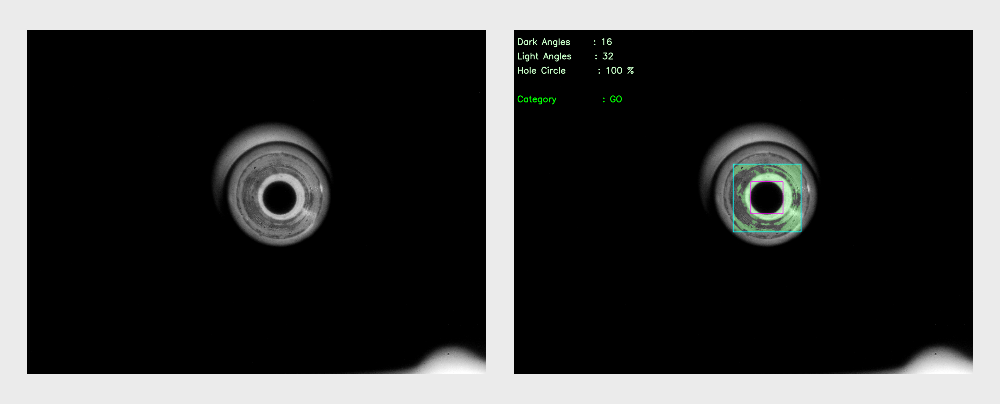
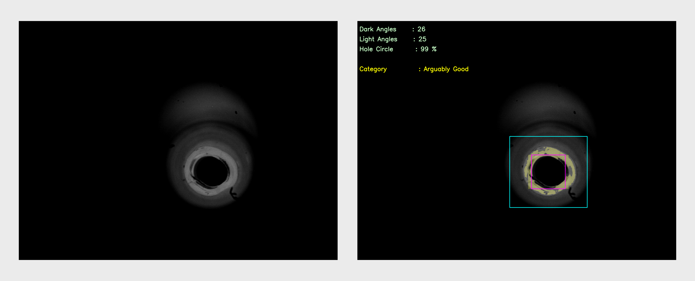
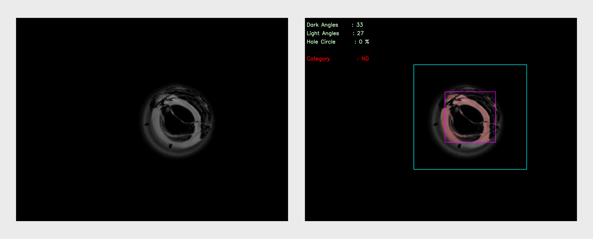

# Introduction

This Python program, created by Ahmad Arif Sultoni, is designed for tip inspections with image processing tasks. The main objective is to analyze images, detect objects, and apply color-coded annotations based on certain criteria (GO, Arguably Good, NG). The program utilizes the OpenCV library for image processing and manipulation.

# Usage

Clone the repository to your local machine:

   ```bash
   git clone https://github.com/arifsoul/tips_inspections.git
   ```

## Configuration

Before running the program, you need to configure the parameters in the [config.cfg](config.cfg) file. This file includes essential settings for image processing, such as rules, transparency, epsilon value, kernel sizes, folder paths, file extensions, and threshold values.

## Running Using Executable

1. Ensure that your input images are located in the specified [input_folder_path](test%20set).

   ```
   input_folder_path/
   |-- image1.jpg
   |-- image2.jpg
   |-- image3.jpg
   |-- image4.jpg
   |-- image5.jpg
   |-- image6.jpg
   ```

2. Run the main script:

   ```bash
   inspections.exe
   ```


## Running Using Python Code

### Installation

1. Install Python version 3.10.13
   
2. Navigate to the project directory:

   ```bash
   cd tips_inspections/python_code
   ```

3. Install the required dependencies:

   ```bash
   pip install -r requirements.txt
   ```

### Running Python Code

To use the program, follow these steps:

1. Ensure that your input images are located in the specified [input_folder_path](test%20set).

   ```
   input_folder_path/
   |-- image1.jpg
   |-- image2.jpg
   |-- image3.jpg
   |-- image4.jpg
   |-- image5.jpg
   |-- image6.jpg
   ```

2. Run the main script:

   ```bash
   python inspections.py
   ```

3. The program will process each image in the input folder according to the defined rules and parameters. The annotated images will be saved in the specified `output_folder_path`.

## Results

The output images are color-coded based on the detected features, such as the number of angles and the percentage of a circular object in the image. The color codes represent different categories, as defined in the [config.cfg](config.cfg) file.

The program also provides textual information on the detected angles and circle percentage, displayed on the processed images.

### Output Structure

Here is an example of the program's output structure:
```
output_folder_path/
|-- GO/
|   |-- GO_image1.jpg
|   |-- GO_image2.jpg
|-- GO_arguably/
|   |-- GO_arguably_image3.jpg
|   |-- GO_arguably_image4.jpg
|-- NG/
|   |-- NG_image5.jpg
|   |-- NG_image6.jpg
```

In this example, images are categorized into different folders based on the defined rules.

### Example Output

1. GO_965.png (Good)
   


2. GO_arguably_5859.png (Arguably Good)
   


3. NG_4967.png (Not Good)
   



## License

This program is distributed under the [MIT License](LICENSE). Feel free to modify and use it in your projects.
